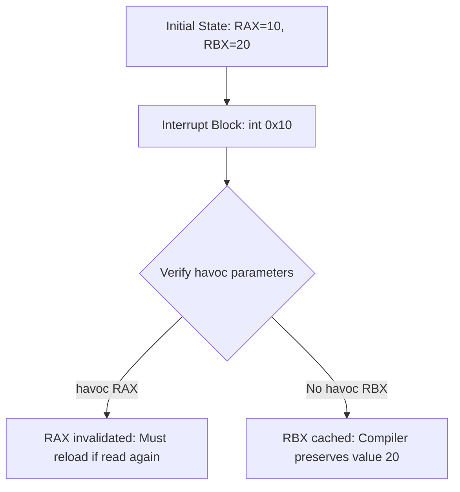

# LayerScript Bare Metal: Hardware & Havoc Semantics

This document details how LayerScript interfaces with physical processor registers, hardware interrupts, and how the `havoc` keyword limits compiler optimization assumptions across hardware boundaries.


---

## 1. Hardware Register State Mapping

LayerScript represents CPU registers directly as variables within the compiler's tracking graph. This allows the compiler to treat inline assembly and register allocation under the same optimization rules.



---

## 2. Fine-Grained `havoc` Semantics

In standard systems programming languages, calling into assembly or external C code acts as a total optimization barrier (compiler memory barrier). The compiler must flush all registers to memory and reload them afterwards because it cannot know what the external code mutated.

LayerScript solves this with `havoc`. It invalidates *only* the specific fields or registers marked, allowing the compiler to keep everything else cached.

### Struct Field Havoc Example
```layerscript
packed struct CPUState {
    b64 rax;
    b64 rbx;
    b64 rcx;
    b64 rdx;
}

fn execute_sys_call(CPUState* cpu) {
    interrupt 'syscall', cpu {
        // A syscall in x86-64 mutates RAX and RCX,
        // but RBX and RDX are guaranteed to be preserved.
        havoc cpu.rax;
        havoc cpu.rcx;
    }
    
    // The compiler knows cpu.rbx has NOT changed.
    // It can safely compile instructions using cpu.rbx without reloading it from memory.
}
```

---

## 3. Real-Mode Mapping and Memory Spaces

In embedded environments or low-level boot loaders, memory spaces are mapped using fixed array constraints:

```layerscript
// Map a fixed byte slice directly to BIOS real-mode screen memory (0xB8000)
[b8; 4000] screen_buffer: at 0xB8000;

fn write_char_to_screen(usize index, b8 character) {
    if (index >= 2000) {
        unreachable; // Informs compiler index bounds check is unnecessary
    }
    
    // Maps directly to memory offset: 0xB8000 + (index * 2)
    screen_buffer[index * 2] = character;
    screen_buffer[index * 2 + 1] = 0x0F; // Light white text attribute
}
```
Using the `at <address>` layout syntax, structures are guaranteed to map exactly to the physical hardware registers, allowing zero-overhead hardware driver development.
