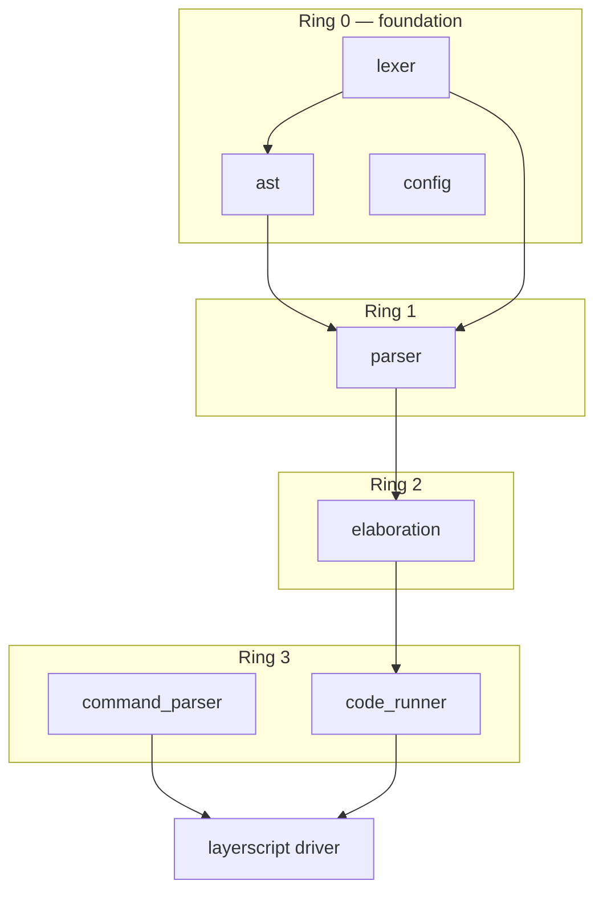
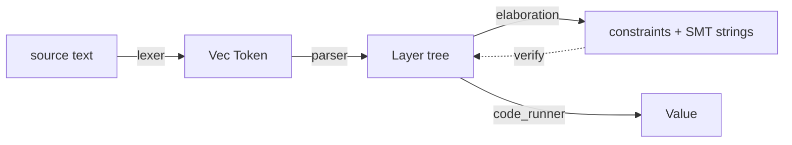

# Codebase Reference

A file-by-file map of the LayerScript compiler as it exists today, grounded in the actual source. For the higher-level tour see [Codebase Navigation](Codebase%20Navigation.md); for the roadmap see the [[Complete Gameplan]].

The compiler is a Cargo **workspace** of unidirectional **rings**: lower rings never depend on higher ones. The `layerscript` binary crate is the driver that stitches them together.

---

## Workspace layout

| Path | Crate | Ring | Role |
| :--- | :--- | :--- | :--- |
| [`rings/ring0/lexer`](../../rings/ring0/lexer/src/lib.rs) | `lexer` | 0 | Text → token stream |
| [`rings/ring0/ast`](../../rings/ring0/ast/src/lib.rs) | `ast` | 0 | `Layer`, `Type`, `Expression`, builders |
| [`rings/ring0/config`](../../rings/ring0/config/src/lib.rs) | `config` | 0 | Global compiler settings |
| [`rings/ring1/parser`](../../rings/ring1/parser/src/lib.rs) | `parser` | 1 | Tokens → layer tree |
| [`rings/ring2/elaboration`](../../rings/ring2/elaboration/src/lib.rs) | `elaboration` | 2 | Constraint extraction + SMT translation |
| [`rings/ring3/command_parser`](../../rings/ring3/command_parser/src/lib.rs) | `command_parser` | 3 | `clap` CLI definition |
| [`rings/ring3/code_runner`](../../rings/ring3/code_runner/src/lib.rs) | `code_runner` | 3 | Tree-walking interpreter |
| [`layerscript/src/main.rs`](../../layerscript/src/main.rs) | `layerscript` | — | Driver: wires the pipeline |

> **Convention:** the compiler source uses **PascalCase** for its own items (`fn RunPipeline`, `let SourceCode`) to keep compiler logic visually distinct from std/library calls. Each crate opts out of the lints with `#![allow(non_snake_case)]` / `#![allow(non_camel_case_types)]`.

---

## Ring 0 · `lexer`

Files: [`src/lib.rs`](../../rings/ring0/lexer/src/lib.rs), [`src/token.rs`](../../rings/ring0/lexer/src/token.rs).

- **`Lexer<'a>`** — wraps `Peekable<Chars>` and tracks `CurrentLine`/`CurrentColumn`. `New`, `NextToken`, `PeekToken` (one-token buffer via `PeekedToken`), and an `Iterator` impl so the driver can `.collect()` tokens.
- **`NextToken`** recognizes: arithmetic/compare operators, delimiters, `//` line comments (recurses to skip), `'…'` **single-quote string literals**, identifiers/keywords, bit-precise type words, and int/float literals.
- **Keyword mapping:** `function`/`fn`→`Function`, `var`→`Let(true)`, `let`→`Let(false)`, `true`→`True`, `false`→`False`, plus `mut where havoc interrupt unreachable panic as match struct enum if else while for loop return goto`.
- **Bit-precise detection:** an identifier like `i32`/`u8`/`b16`/`f64` (leading `i/u/b/f` + all digits) becomes `BitPreciseType { Kind, Bits }`.
- **`token.rs`** defines `Token { Kind, Line, Column }` and the `TokenKind` enum (keywords, `Ident`, `IntLiteral`, `FloatLiteral`, `StringLiteral`, `BitPreciseType`, operators, delimiters). Note `Let(bool)` encodes mutability at the token level.

> **Known gaps:** no `==`/`!=`/`&&`/`||`/`!`/bitwise tokens (a lone `=` is `Equal`); no hex/octal/binary or underscored literals; no literal suffixes; `:=` lexes to `TypeSet` but is unused. See [[Phase 1 - Parser]].

---

## Ring 0 · `ast`

Files: [`src/lib.rs`](../../rings/ring0/ast/src/lib.rs), [`src/types.rs`](../../rings/ring0/ast/src/types.rs).

- **`Layer`** — the universal node: `Id`, `Kind`, `Metadata`, `Children`, `Constraints`, `Observability`, `TypeStorage`, `VariableStorage`, `TraceInfo`. See [Layer System](../Language%20Specification/Layer%20System.md).
- **`LayerKind`** — `Program`, `Function`, `VariableBinding`, `VariableHook`, `Assignment`, `Expression`, `Block`, `Loop{Label,Kind}`, `Conditional{Condition,HasElse}`, `MatchArm{Pattern,Guard}`, `Panic`, `Unreachable`, `Havoc{Target}`, `Interrupt{Syscall}`, `Struct`, `Enum`, `Return`.
- **`LayerBuilder`** — fluent builder (`WithDoc`, `WithChild(ren)`, `WithConstraint`, `Build`). IDs come from a process-global `LayerAddress: AtomicUsize`.
- **`Layer` methods:** `AddType`, `AddVariable`, `IsRoot`, `AddDependency` (pushes a `Constraint::POMSET`).
- **`types.rs`** — `Type` (`BitPrecise(char,u32)`, `Named`, `Pointer`, `Array`, `Where(Type,Expression)`, `Unit`, **`Inferred`**), `Expression` (literals, `Variable`, `BinaryOp`, `UnaryOp`, `FunctionCall`, `MemberAccess`, `IndexAccess`, `BitPreciseType`), `Param`, `StructField`, `EnumVariant`, `GenericParam`, `Pattern` (`Wildcard/Literal/Variable/Variant`), `VariableHook` + `HookKind` (`OnChange/OnRead/OnAssign/OnDrop/OnError`), `TypeStorage`/`TypeDefinition`/`TypeKind`, `VariableStorage`/`VariableDefinition`, `SourceLocation`, `Directive`, `OptimizationHints`, `ObservabilityFlags`, `Constraint` (`RefinedType/Safety/POMSET`), `TraceInfo`/`TraceContext`.

> **Known gaps:** no parent link on `Layer`; `Metadata.Custom`/`Optimization` unpopulated. See [[Phase 2 - Layer Tree]].

---

## Ring 0 · `config`

File: [`src/lib.rs`](../../rings/ring0/config/src/lib.rs). Currently a single `pub static Verbose: bool = true;`. Intended to grow into real build settings ([[Phase 6 - Tooling and Developer Experience]]).

---

## Ring 1 · `parser`

File: [`src/lib.rs`](../../rings/ring1/parser/src/lib.rs). A hand-written recursive-descent + precedence-climbing parser over `Vec<Token>` with a `Position` cursor.

- **Cursor helpers:** `Peek`, `PeekAt(n)`, `Advance`, `Check`, `Match`, `Consume`, `IsAtEnd`.
- **Entry:** `Parse` → `Program` layer; `ParseItem` dispatches `function`/`struct`/statement.
- **Declarations:** `ParseStruct`, `ParseFunction` (params via `ParseNameAndType`, optional `-> Type`, brace body), `ParseNameAndType` (handles `name: Type`, `Type name`, and inferred `name = …` → `Type::Inferred`, plus `where` refinements), `ParseType` (pointers, bit-precise, named, `where`).
- **Statements:** `ParseStatement` covers `panic`, `unreachable`, `let`/`var` (→ `ParseVariableBinding`), `return`, `havoc`, `interrupt`, `if`, `while`, block, and an expression/assignment fallback. `ParseVariableBinding` parses `{ on_change: … }` hook blocks and registers variables into the enclosing `Layer`'s `VariableStorage`.
- **Expressions:** `ParseExpression` → `ParseBinary(precedence)` (climbing) → `ParsePrimary` (postfix `.`, `()`, `[]`) → `ParseAtom` (literals, idents, `*deref`, parens). `TokenPrecedence` is the precedence table.

> **Known gaps:** `match`/`for`/`loop`/`goto`/`enum` unparsed; only `on_change`/`on_read` hooks recognized; no unary `-`/`!`; no generics; `SourceLocation::Builtin()` used everywhere instead of real spans. See [[Phase 1 - Parser]].

---

## Ring 2 · `elaboration`

File: [`src/lib.rs`](../../rings/ring2/elaboration/src/lib.rs).

- **`ElaborationContext { Constraints: Vec<String>, KnownVars: HashSet<String> }`.**
- **`ElaborateLayer`** recurses the tree, recording variables and translating `where` clauses on `Function` params and `VariableBinding`s; prints goals for `Panic` and branch constraints for `Conditional`.
- **`TranslateToSmt`** lowers `Expression` to prefix SMT-LIB strings (`LiteralInt`, `Variable`, `BinaryOp`, `FunctionCall`).

> **Known gaps:** no Z3 (strings are built, never solved); no `sat`/`unsat` decision, no POMSET graph, no observability computation, no `Type::Inferred` resolution; always returns `Ok(())`. This is the heart of [[Phase 3 - Elaboration and Constraints]]. Details in [Elaboration and Constraints](Elaboration%20and%20Constraints.md).

---

## Ring 3 · `code_runner`

File: [`src/lib.rs`](../../rings/ring3/code_runner/src/lib.rs). The tree-walking interpreter.

- **`CodeRunner { Context, Trace, Config }`** with `RunCode` → `RunLayer` recursion.
- **`EvaluateExpression`** — `LiteralInt/Float/Bool`, `Variable` (via `ExecutionContext::GetVariable`), `BinaryOp` (through `EvaluateBinaryOp`: arithmetic operators, comparison operators `< <= > >= == !=`, with divide-by-zero guard).
- **`RunLayer`** — `Program` (run children), `Function` (`PushFrame`/`PopFrame`, `RunBlock`, `CheckType` on return), `VariableBinding` (eval init or `DefaultValue`, run hooks, `SetVariable`), `Return`. `RunBlock` stops after a `Return`.
- **`ExecutionContext`** — global `Variables` + a `Stack` of `Frame`s; `SetVariable` writes to the top frame; `GetVariable` searches frames then globals. **`Value`**: `Unit/Int/Float/Bool/String/Array/Struct`.
- **`CompilerError`** — `Lexer/Parser/Elaboration/Type/Runtime/Internal` variants; `CompilerResult<T>` alias.
- Includes unit tests for literal/binary evaluation and refinement checks.

> **Known gaps / bugs:** hook bodies run with empty `Children` (so hooks are effectively no-ops); `on_assign`/`on_change` fire in reverse of the [Hooks Runtime](../Execution%20Model/Variable%20Behavior%20Hooks%20Runtime.md) spec; no `Loop`/`MatchArm` execution; `havoc` arm commented out; stray `print!("GetVar …")` in `GetVariable`; `FindMainFunction` unused. See [[Phase 4 - Execution Engine]].

---

## Ring 3 · `command_parser` + `layerscript` driver

Files: [`command_parser/src/lib.rs`](../../rings/ring3/command_parser/src/lib.rs), [`layerscript/src/main.rs`](../../layerscript/src/main.rs).

- **`Cli`** (`clap`): global `--verbose/-v`, `--workspace/-w`; subcommands `Compile { Input, OptLevel(-O, default 2) }`, `Eval { Code }`, `Test { Filter(-f) }`. Binary `name = "layerscript"`. See [CLI Reference](../API%20and%20Standard%20Library/CLI%20Reference.md).
- **`main.rs`** — `RunPipeline(SourceCode, Verbose)` runs Lexer → Parser → `ElaborationContext::ElaborateLayer` → `CodeRunner::RunCode`, printing the AST item count and execution result. `Compile` reads the file; `Eval` runs the inline string; `Test` is a stub.

---

## The pipeline end to end

Verified today: `cargo run -- eval "function main() { var x = 30; }"` walks this whole path and prints `Execution Result: Unit`.

## See also
- [Codebase Navigation](Codebase%20Navigation.md) · [Compiler Implementation](Compiler%20Implementation.md) · [[Complete Gameplan]]
