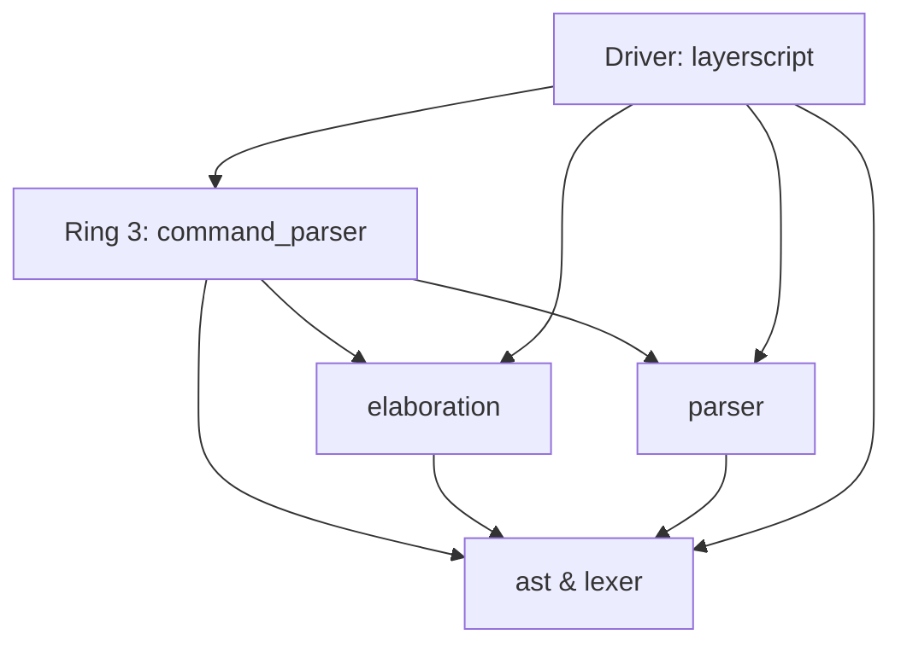

# LayerScript Compiler: Reference Implementation

This document describes the concrete Rust codebase structure, module layout, and implementation choices of the **LayerScript compiler (`layerscript`)** workspace.

---

## 1. Multi-Crate Workspace Architecture (The Rings)

The `layerscript` compiler is structured as a multi-crate Cargo workspace. It directly implements the **Ring System** dependency rules to maintain unidirectional relationships between compiler phases:



### Path Locations
- **Ring 0 (Independent Core)**:
  - [`ast`](file:///C:/Users/Kyle/Downloads/Projects/LayerScript/rings/ring0/ast): contains the `Layer` and `Type` structures.
  - [`lexer`](file:///C:/Users/Kyle/Downloads/Projects/LayerScript/rings/ring0/lexer): contains the tokenizer.
- **Ring 1 (Parsing)**:
  - [`parser`](file:///C:/Users/Kyle/Downloads/Projects/LayerScript/rings/ring1/parser): transforms tokens into recursive `Layer` trees.
- **Ring 2 (Verification)**:
  - [`elaboration`](file:///C:/Users/Kyle/Downloads/Projects/LayerScript/rings/ring2/elaboration): collects semantic constraints for SMT checking.
- **Ring 3 (Interface)**:
  - [`command_parser`](file:///C:/Users/Kyle/Downloads/Projects/LayerScript/rings/ring3/command_parser): handles CLI arguments and workspace setup.

---

## 2. Core Implementation Components

### A. The "Everything is a Layer" AST (`ast`)
the ast is organized into two primary files:
- **`types.rs`**: holds the atomic components like `Type`, `Expression`, `Constraint`, and `MetadataValue`.
- **`lib.rs`**: holds the `Layer` struct, which is the universal container for all code constructs.

to prevent infinite size errors in rust, recursive variants like `Layer` children or nested `Type` pointers are wrapped in `Box` or `Vec`.

### B. PascalCase Coding Style
the compiler implementation uses **PascalCase** for all identifiers (functions, variables, fields) to distinguish internal logic from standard Rust conventions. this is enabled via:
```rust
#![allow(non_snake_case)]
#![allow(non_camel_case_types)]
```

### C. Source Location Tracking
the lexer and parser track exactly where every token starts. every `Token` has a `Line` and `Column` field.
- **Line Tracking**: increments on `\n`.
- **Column Tracking**: resets to 1 on `\n`, otherwise increments per character.
- **Layer Metadata**: every `Layer` carries a `SourceLocation` for precise error reporting.

### D. SMT-LIB v2 Translation
the elaborator (Ring 2) translates layerscript expressions into **SMT-LIB v2** strings.
- **Prefix Notation**: `x < 10` becomes `(< x 10)`.
- **Hypothesis assertions**: refinements are asserted into the solver state before reaching safety goals like `panic`.

---

## 3. Compilation Trace Example

when you pass the source input `"panic;"` into the compiler, it goes through this flow:

```mermaid
sequenceDiagram
    participant Main as Driver (layerscript)
    participant Lex as Lexer (lexer)
    participant Par as Parser (parser)
    participant Elab as Elaborator (elaboration)
    
    Main->>Lex: Lexer::New("panic;")
    Lex-->>Main: [Token { Kind: Panic, Line: 1, Column: 1 }, ...]
    
    Main->>Par: Parser::New(Tokens)
    Par->>Par: ParseStatement()
    Par-->>Main: Layer { Kind: LayerKind::Panic, ... }
    
    Main->>Elab: ElaborateLayer(PanicLayer)
    Elab->>Elab: println!("🔍 SMT Goal: Is 'panic' unreachable?")
    Elab-->>Main: ElaborationContext { Constraints: [] }
    
    Main->>Main: Output Successful Trace
```
