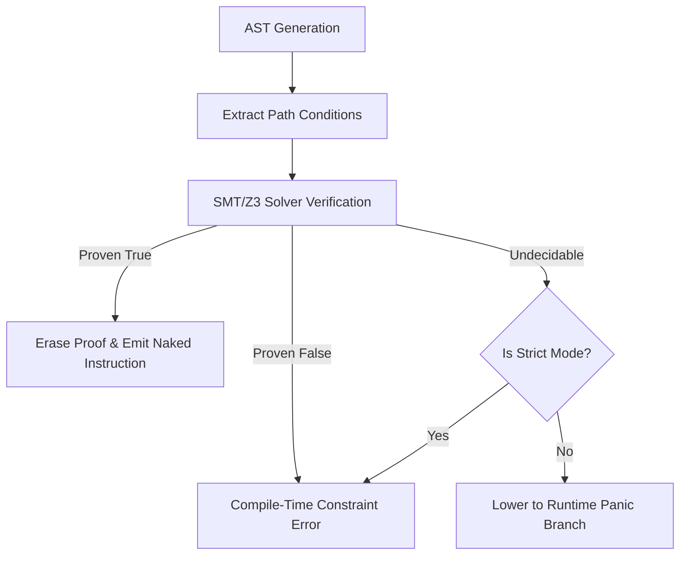

# LayerScript Compiler: Elaboration & Constraints

This document details the mechanics of the compiler's **Elaboration Phase** and how it integrates compile-time mathematical reasoning with runtime code emission.


---

## 1. The Elaboration Phase

The Elaboration Phase occurs after AST parsing and standard type resolution. Its job is to expand high-level syntax into a fully explicit dependency graph containing logical path conditions.



### Verification Pipeline in Rust
In `layerscriptc`, the elaboration engine translates local constraints to SMT assertions using the `z3` API:

```rust
pub fn verify_addition_safety(
    left_min: i64, left_max: i64,
    right_min: i64, right_max: i64,
    target_bits: u32,
) -> bool {
    let cfg = z3::Config::new();
    let ctx = z3::Context::new(&cfg);
    let solver = z3::Solver::new(&ctx);

    // Represent the inputs as variables
    let lhs = z3::ast::Int::new_const(&ctx, "lhs");
    let rhs = z3::ast::Int::new_const(&ctx, "rhs");

    // Add boundaries based on compile-time type limits or prior assertions
    solver.assert(&lhs.ge(&z3::ast::Int::from_i64(&ctx, left_min)));
    solver.assert(&lhs.le(&z3::ast::Int::from_i64(&ctx, left_max)));
    solver.assert(&rhs.ge(&z3::ast::Int::from_i64(&ctx, right_min)));
    solver.assert(&rhs.le(&z3::ast::Int::from_i64(&ctx, right_max)));

    // Calculate signed boundaries
    let max_val = (1 << (target_bits - 1)) - 1;
    let min_val = -(1 << (target_bits - 1));

    // Express overflow constraint
    let sum = &lhs + &rhs;
    let overflow = sum.gt(&z3::ast::Int::from_i64(&ctx, max_val))
        .or(&[&sum.lt(&z3::ast::Int::from_i64(&ctx, min_val))]);

    // Assert the negation of the safety condition to look for counterexamples
    solver.assert(&overflow);

    // If UNSAT, no overflow counterexample exists -> addition is statically safe!
    solver.check() == z3::SatResult::Unsat
}
```

---

## 2. Strict Mode vs. Relaxed Mode

LayerScript permits two compilation modes depending on the performance/safety requirements:

1. **Relaxed Mode (Default)**
   - If the compiler cannot prove a constraint statically, it silently emits a conditional branch checking the bounds at runtime.
   - Example output:
     ```asm
     add rdi, rsi
     jo .panic_overflow_handler ; Jump to panic if overflow flag is set
     ```

2. **Strict Mode**
   - The compiler refuses to generate any fallback branches.
   - If a constraint cannot be proven statically, compilation fails with an error:
     ```text
     error: constraint check failed.
     Cannot prove: (a + b) does not overflow i8.
     Hint: Add a precondition, or cast to a wider integer type.
     ```
