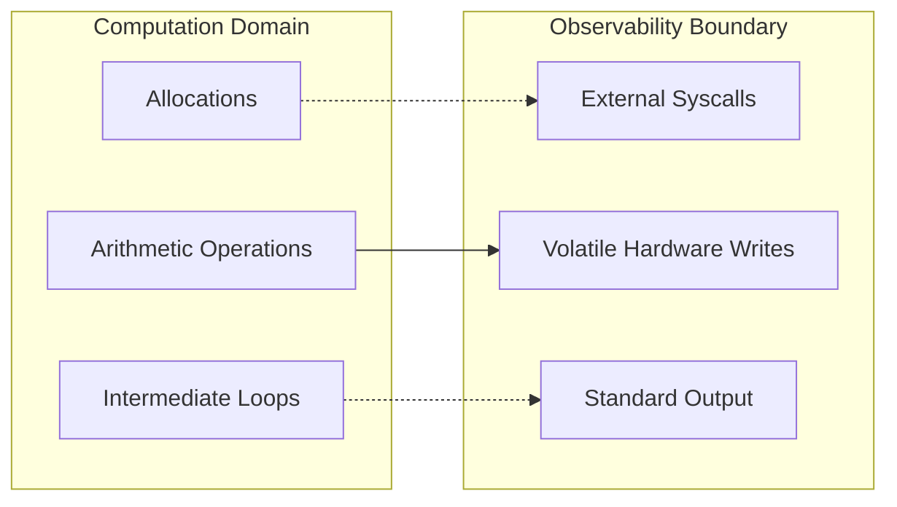

# LayerScript Compiler: Observability & Trace Folding

This document details how the LayerScript Abstract Machine (BAM) optimizes side-effect-free code by reducing computation graphs down to minimal constants or closed-form expressions.

---

## 1. The Observability Boundary

In LayerScript, everything is evaluated on a "need-to-observe" basis. The program's compiler output is generated by tracing dependencies backward from the **Observability Boundary**.



### Observable Entities
- Volatile memory writes (e.g. `volatile_write(0x3F8, byte)`)
- Builtin I/O system calls
- Inter-thread message boundaries (atomic synchronization points)

If a sequence of instructions, allocation, or loop does not eventually write to an observable channel, the compiler is free to delete the code entirely.

---

## 2. Trace Folding & Loop Reduction

Unlike standard compilers that only fold constant expressions (like `2 + 3` into `5`), `layerscriptc` attempts to mathematically solve loops that contain induction variables and recurrence relations.

### Analytical Recurrence Solving
When a loop is identified as a pure mathematical operation (no external side effects), `layerscriptc` extracts the loop body as a system of equations:

For example:
```layerscript
fn compute_sum(usize limit) -> usize {
    usize total = 0;
    for (usize i = 1; i <= limit; i++) {
        total += i;
    }
    return total;
}
```

Instead of compiling this into a loop with $O(N)$ cycles, the compiler analyzes the induction variable. It matches the pattern against standard arithmetic sequences:
$$S_n = \sum_{i=1}^{n} i = \frac{n(n+1)}{2}$$

The compiler then emits code equivalent to:
```layerscript
fn compute_sum_folded(usize limit) -> usize {
    return (limit * (limit + 1)) >> 1;
}
```
This reduces the execution complexity from $O(N)$ to $O(1)$. 

If the limit variable is statically known at compile time, the entire function call is folded into a single constant.
