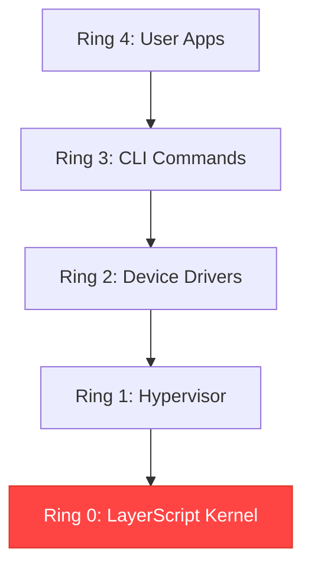

# LayerScript Compiler: Parser, Lexer & OS Lower-Ring Target

this document explains how we turn raw text into a working program and why we made certain choices.

---

## 1. syntax choices

we use the `function` (or `fn`) keyword to keep things clear.

```layerscript
// layerscript style: no confusion
function foo() -> i32 { return 32; }
```

in old languages like C, it's hard to tell if something is a function or a variable. by using a keyword, the `Lexer` and `Parser` can move way faster because they always know what's coming next.

---

## 2. implementation: why rust?

we chose **Rust** for the compiler because:
- **speed**: it compiles code almost instantly.
- **safety**: the "Ring System" (0-3) is enforced by Rust's crate system, so we don't accidentally make a mess of the dependencies.
- **PascalCase**: we use a specific coding style in the Rust code to keep things organized.

---

## 3. low-level targets

layerscript is built to replace assembly for kernels and bootloaders.



### bare metal features
- **No-Std**: the compiler doesn't need an OS to run.
- **Direct Addressing**: you can map a struct directly to a memory address (like `0x7C00` for boot sectors).
- **Havoc**: you have total control over when the compiler should forget what's in a CPU register.
