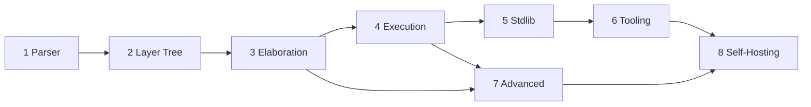

# 🎯 LayerScript — Complete Gameplan (Overview)

This is the top-level roadmap for LayerScript. It is intentionally short: it tracks **where we are**, summarizes the eight phases, and links to a detailed plan for each. Open a phase file for its full task breakdown, design notes, code touchpoints, and acceptance criteria.

> [!TIP]
> Detailed plans live in the [[Gameplan]] folder — one note per phase. Start with the phase that owns the [Immediate Next Steps](#-immediate-next-steps).

---

## 📊 Current State Assessment

| Component | Status | Notes |
|-----------|--------|-------|
| **Lexer** (`ring0/lexer`) | ✅ Complete | Tokens for `function`, `var`/`let`, `havoc`, bit-precise types, literals (double/single quoted). |
| **AST / Layer** (`ring0/ast`) | ✅ Complete | "Everything is a Layer"; `Type` includes `Inferred`; tracks `VariableStorage`. |
| **Parser** (`ring1/parser`) | ✅ Complete | Handles structures, functions, precedence-climbing expressions (with comparisons/logical ops), and statements. |
| **Elaboration** (`ring2/elaboration`) | 🚧 ~40% | Constraint extraction + SMT translation (now translates `!=` to `distinct`); **no Z3 yet**. |
| **Interpreter** (`ring3/code_runner`) | 🚧 ~85% | Walks the layer tree. Supports function calls, refinement constraints, blocks, conditional branches, and nested returns. |
| **Codegen** | ❌ Not started | Bytecode / assembly pending. |
| **CLI** (`ring3/command_parser` + `layerscript`) | ✅ Complete | `compile`, `eval`, `test`; runs the end-to-end pipeline with error matching. |

**Reality check (verified):** `cargo run -- compile examples/refinement.ls` successfully parses, type-checks, and executes code, dynamically catching refinement violations at runtime.

---

## 🗺️ The Eight Phases

| Phase | Focus | Est. | Detailed plan |
|------:|-------|------|---------------|
| 1 | Parser | 1–2 wks | [[Phase 1 - Parser]] |
| 2 | Layer Tree | 1 wk | [[Phase 2 - Layer Tree]] |
| 3 | Elaboration & Constraints | 1 wk | [[Phase 3 - Elaboration and Constraints]] |
| 4 | Execution Engine | 1 wk | [[Phase 4 - Execution Engine]] |
| 5 | Standard Library & Runtime | 1 wk | [[Phase 5 - Standard Library and Runtime]] |
| 6 | Tooling & DX | 1 wk | [[Phase 6 - Tooling and Developer Experience]] |
| 7 | Advanced Features | 1 wk | [[Phase 7 - Advanced Features]] |
| 8 | Self-Hosting | 2 wks | [[Phase 8 - Self-Hosting]] |

---

## 🚀 Immediate Next Steps

The critical path runs through execution and elaboration. Current next steps:

1. **Hook execution & bodies.** Fix hook execution in `code_runner` (populate hook-body `Children`, run `on_change` pre-store and use its return, run `on_assign` post-store).
2. **Control-flow execution.** Implement `Loop` (`While`/`For`/`Infinite`) statement execution in `RunLayer` in `code_runner` (`Conditional` and `Block` are complete).
3. **SMT Solver Integration.** Integrate a real Z3 solver in Ring 2 `elaboration` to verify constraints statically at compile time.

---

## ✅ Success Criteria

| Criteria | How to Verify |
|----------|---------------|
| **Parsing** | `cargo test` passes expression/statement tests |
| **Layer Tree** | `{:#?}` on the root shows a complete, parent-linked tree |
| **Interpretation** | `layerscript eval "..."` returns the correct `Value` |
| **Verification** | A provably out-of-bounds access fails compilation with a counterexample |
| **Codegen** | `layerscript compile x.layerscript` emits a working binary |
| **Self-hosting** | `layerscript compile layerscript.layerscript` reproduces the compiler |

---

## 🎯 The Goal in One Sentence

**"A language where everything is an observable layer, constraints are checked at compile time, and code executes at maximum speed through POMSET parallelism."**

## See also
- [[Home]] — vault index
- [Codebase Navigation](Compiler%20Mechanics/Codebase%20Navigation.md)
- [Compiler Implementation](Compiler%20Mechanics/Compiler%20Implementation.md)
