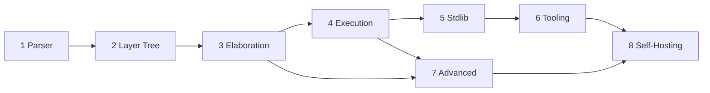

# 🎯 LayerScript — Complete Gameplan (Overview)

This is the top-level roadmap for LayerScript. It is intentionally short: it tracks **where we are**, summarizes the eight phases, and links to a detailed plan for each. Open a phase file for its full task breakdown, design notes, code touchpoints, and acceptance criteria.

> [!TIP]
> Detailed plans live in the [[Gameplan]] folder — one note per phase. Start with the phase that owns the [Immediate Next Steps](#-immediate-next-steps).

---

## 📊 Current State Assessment

| Component | Status | Notes |
|-----------|--------|-------|
| **Lexer** (`ring0/lexer`) | ✅ Complete | Tokens for `function`, `var`/`let`, `havoc`, bit-precise types, literals. |
| **AST / Layer** (`ring0/ast`) | ✅ Complete | "Everything is a Layer"; `Type` now includes `Inferred`. |
| **Parser** (`ring1/parser`) | 🚧 ~70% | Functions, structs, typed **and inferred** bindings, refinements; full expression precedence + all statements still pending. |
| **Elaboration** (`ring2/elaboration`) | 🚧 ~35% | Runs over the tree, basic constraint extraction; **no Z3 yet**. |
| **Interpreter** (`ring3/code_runner`) | 🚧 Early | Walks the layer tree and executes simple programs (returns a `Value`). |
| **Codegen** | ❌ Not started | Bytecode / assembly pending. |
| **CLI** (`ring3/command_parser` + `layerscript`) | 🚧 Working scaffold | `compile`, `eval`, `test`; `eval`/`compile` run the full pipeline. |

**Reality check (verified):** `cargo run -- eval "function main() { var x = 30; let y = 3.5; var z: i32 = 7; }"` parses → elaborates → runs → prints `Execution Result: Unit`. The end-to-end pipeline is alive for trivial programs; the work now is depth.

---

## 🗺️ The Eight Phases

| Phase | Focus | Est. | Detailed plan |
|------:|-------|------|---------------|
| 1 | Parser | 1–2 wks | [[Phase 1 - Parser]] |
| 2 | Layer Tree | 1 wk | [[Phase 2 - Layer Tree]] |
| 3 | Elaboration & Constraints | 1 wk | [[Phase 3 - Elaboration and Constraints]] |
| 4 | Execution Engine | 1 wk | [[Phase 4 - Execution Engine]] |
| 5 | Standard Library & Runtime | 1 wk | [[Phase 5 - Standard Library and Runtime]] |
| 6 | Tooling & DX | 1 wk | [[Phase 6 - Tooling and Developer Experience]] |
| 7 | Advanced Features | 1 wk | [[Phase 7 - Advanced Features]] |
| 8 | Self-Hosting | 2 wks | [[Phase 8 - Self-Hosting]] |

---

## 🚀 Immediate Next Steps

The critical path runs through the parser. See [[Phase 1 - Parser]] for the full breakdown; the first three tasks:

1. **Expression precedence.** Finish precedence climbing in [`rings/ring1/parser`](rings/ring1/parser/src/lib.rs) so `1 + 2 * 3`, calls, field access, and indexing all parse.
2. **Statement coverage.** `if`/`while`/`for`/`match`/`return`/`havoc` as first-class statement layers.
3. **Elaboration types.** Resolve `Type::Inferred` from the initializer in [`rings/ring2/elaboration`](rings/ring2/elaboration/src/lib.rs) so inferred bindings carry a concrete width downstream.

---

## ✅ Success Criteria

| Criteria | How to Verify |
|----------|---------------|
| **Parsing** | `cargo test` passes expression/statement tests |
| **Layer Tree** | `{:#?}` on the root shows a complete, parent-linked tree |
| **Interpretation** | `layerscript eval "..."` returns the correct `Value` |
| **Verification** | A provably out-of-bounds access fails compilation with a counterexample |
| **Codegen** | `layerscript compile x.layerscript` emits a working binary |
| **Self-hosting** | `layerscript compile layerscript.layerscript` reproduces the compiler |

---

## 🎯 The Goal in One Sentence

**"A language where everything is an observable layer, constraints are checked at compile time, and code executes at maximum speed through POMSET parallelism."**

## See also
- [[Home]] — vault index
- [Codebase Navigation](Compiler%20Mechanics/Codebase%20Navigation.md)
- [Compiler Implementation](Compiler%20Mechanics/Compiler%20Implementation.md)
