# Welcome to LayerScript: The Principle of Most Speed

**LayerScript** is an experimental, bare-metal systems programming language designed for hyper-aggressive optimization. Rather than translating sequential code directly into instructions, LayerScript models your program as a **Partially Ordered Multiset (POMSET) of traces** subject to logical constraints. If a value or operation does not affect the program's **Observability Boundary**, the compiler is free to compile it away, dissolve it into registers, or fold it entirely at compile-time.

---

## 🗺️ Documentation Sitemap

Explore the technical details of the LayerScript Language:

* [Complete Gameplan](Complete%20Gameplan.md) ⭐ UPDATED — now split into per-phase files
    * [Phase 1 — Parser](Gameplan/Phase%201%20-%20Parser.md)
    * [Phase 2 — Layer Tree](Gameplan/Phase%202%20-%20Layer%20Tree.md)
    * [Phase 3 — Elaboration & Constraints](Gameplan/Phase%203%20-%20Elaboration%20and%20Constraints.md)
    * [Phase 4 — Execution Engine](Gameplan/Phase%204%20-%20Execution%20Engine.md)
    * [Phase 5 — Standard Library & Runtime](Gameplan/Phase%205%20-%20Standard%20Library%20and%20Runtime.md)
    * [Phase 6 — Tooling & DX](Gameplan/Phase%206%20-%20Tooling%20and%20Developer%20Experience.md)
    * [Phase 7 — Advanced Features](Gameplan/Phase%207%20-%20Advanced%20Features.md)
    * [Phase 8 — Self-Hosting](Gameplan/Phase%208%20-%20Self-Hosting.md)
* [Glossary](Glossary.md)

### 📖 Language Specification
* [Syntax and Grammar](Language%20Specification/Syntax%20and%20Grammar.md)
* [Base and Compound Types](Language%20Specification/Base%20and%20Compound%20Types.md)
* [Variables and Hooks](Language%20Specification/Variables%20and%20Hooks.md)
* [Control Flow and Statements](Language%20Specification/Control%20Flow%20and%20Statements.md)
* [Functions and Procedures](Language%20Specification/Functions%20and%20Procedures.md)
* [First-Class Types and Generics](Language%20Specification/First-Class%20Types%20and%20Generics.md)
* [Layer System](Language%20Specification/Layer%20System.md)
* [Modules and Namespaces](Language%20Specification/Modules%20and%20Namespaces.md) ⭐ NEW
* [Traits and Operator Overloading](Language%20Specification/Traits%20and%20Operator%20Overloading.md) ⭐ NEW
* [Pattern Matching](Language%20Specification/Pattern%20Matching.md) ⭐ NEW

### 🧩 Type System and Coercions
* [Coercion Guide](Type%20System%20and%20Coercions/Coercion%20Guide.md)
* [Refined Types](Type%20System%20and%20Coercions/Refined%20Types.md)
* [Type Storage and Inheritance](Type%20System%20and%20Coercions/Type%20Storage%20and%20Inheritance.md)

### ⚙️ Compiler Mechanics
* [Compiler Implementation](Compiler%20Mechanics/Compiler%20Implementation.md)
* [Codebase Navigation](Compiler%20Mechanics/Codebase%20Navigation.md)
* [Codebase Reference](Compiler%20Mechanics/Codebase%20Reference.md) ⭐ NEW — file-by-file, code-grounded
* [Parser and Lexer](Compiler%20Mechanics/Parser%20and%20Lexer.md)
* [Elaboration and Constraints](Compiler%20Mechanics/Elaboration%20and%20Constraints.md)
* [Observability and Trace Folding](Compiler%20Mechanics/Observability%20and%20Trace%20Folding.md)
* [Type Checking and Inference](Compiler%20Mechanics/Type%20Checking%20and%20Inference.md)

### 🚀 Execution Model
* [POMSET and Task Scheduler](Execution%20Model/POMSET%20and%20Task%20Scheduler.md)
* [layertrace Runtime](Execution%20Model/layertrace%20Runtime.md)
* [Variable Behavior Hooks Runtime](Execution%20Model/Variable%20Behavior%20Hooks%20Runtime.md)

### 🔧 Bare Metal Interfacing
* [Hardware and Havoc](Bare%20Metal%20Interfacing/Hardware%20and%20Havoc.md)
* [Memory Layout and Packing](Bare%20Metal%20Interfacing/Memory%20layout%20and%20Packing.md)
* [FFI and extern](Bare%20Metal%20Interfacing/FFI%20and%20extern.md)

### 🛠️ API and Standard Library
* [Core Library Reference](API%20and%20Standard%20Library/Core%20Library%20Reference.md)
* [Runtime and Compiler API](API%20and%20Standard%20Library/Runtime%20and%20Compiler%20API.md)
* [Built-in Types Reference](API%20and%20Standard%20Library/Built-in%20Types%20Reference.md)
* [CLI Reference](API%20and%20Standard%20Library/CLI%20Reference.md) ⭐ NEW

### 📚 Tutorials and Examples
* [LayerScript Cookbook](Tutorials%20and%20Examples/LayerScript%20Cookbook.md)
* [Simple Scripts](Tutorials%20and%20Examples/Simple%20Scripts.md)
* [Standard Algorithms](Tutorials%20and%20Examples/Standard%20Algorithms.md)
* [Layer System Examples](Tutorials%20and%20Examples/Layer%20System%20Examples.md)

---

## ⚡ Syntax Cheat Sheet (New LayerScript)

```layerscript
// 1. Bit-Precise and Refined Types
var age: u32 = 25;         // Unsigned 32-bit scalar
var mut delta: i8 = -1;    // Signed 8-bit mutable scalar
var flags: b16 = 0xFFFF;   // Raw 16-bit vector

// Refined parameters: Index must be mathematically proven < length N
function safe_read<T, N: usize>(arr: T*, idx: usize where idx < N) -> T {
    return arr[idx];       // Compiles with zero bounds-checking!
}

// 2. Types as First-Class Values
function IntOrFloat(is_float: bool) -> type {
    match is_float {
        true => return f32,
        false => return i32,
    }
}
var value: IntOrFloat(true) = 1.5;

// 3. Variable Hooks
var health: f64 = 100.0 {
    on_change: function(new, old) -> f64 {
        if new < 0 { return 0; }
        return new;
    }
}

// 4. Hardware Mapping
packed struct RegisterState {
    rax: b64,
    rbx: b64,
}
```

---

## 🎯 Language Architecture

```mermaid
graph TD
    A[LayerScript Language] --> B[Language Spec]
    A --> C[Type System]
    A --> D[Compiler]
    A --> E[Execution]
    A --> F[Bare Metal]
    A --> G[API/Stdlib]
    A --> H[Glossary]
    
    B --> B1[Syntax]
    B --> B2[Types]
    B --> B3[Variables + Hooks]
    B --> B4[Control Flow]
    B --> B5[Functions]
    B --> B6[Layer System]
    B --> B7[Modules + Namespaces]
    B --> B8[Traits + Overloading]
    B --> B9[Pattern Matching]
    
    C --> C1[Coercions]
    C --> C2[Refined Types]
    C --> C3[Type Storage + Inheritance]
    
    D --> D1[Parser/Lexer]
    D --> D2[Constraints/Z3]
    D --> D3[Observability]
    D --> D4[Type Checking]
    
    E --> E1[POMSET]
    E --> E2[layertrace]
    E --> E3[Hooks Runtime]
    
    F --> F1[Havoc]
    F --> F2[Interrupt]
    F --> F3[Memory Layout]
    F --> F4[FFI]
    
    G --> G1[Core Library]
    G --> G2[Runtime API]
    G --> G3[Built-in Types]
    G --> G4[CLI Reference]
```


