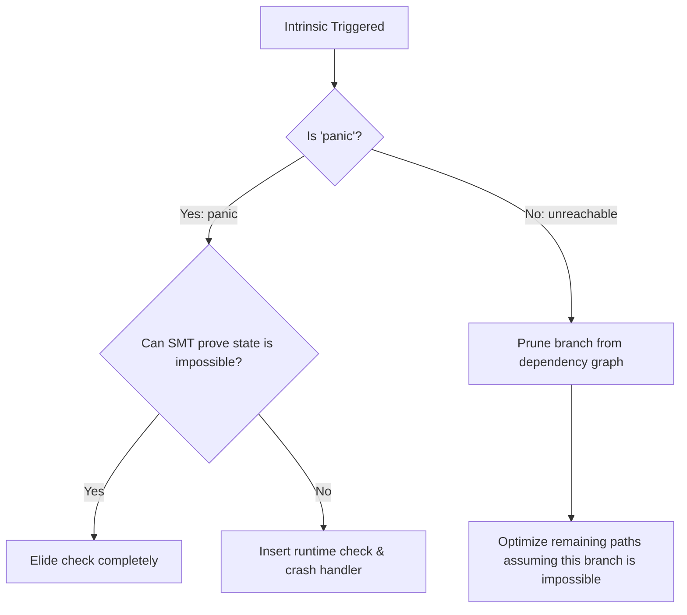

# LayerScript Language: Control Flow and Statements

This document specifies the statements, block structure, scoping, variable bindings, branching, loops, and control flow intrinsics in the LayerScript programming language.

---

## 1. Variable Bindings and Scoping

LayerScript programs organize execution within lexical blocks defined by curly braces `{}`. Variables declared inside a block are scoped locally to that block and are automatically cleaned up or dissolved at the earliest safe point in the trace graph.

### A. Variable Declaration
Variables are declared using the `var` keyword.
```layerscript
var counter: i32 = 0;
var threshold: f64 = 1.234;
```

### B. Mutability: `var` vs `var mut`
LayerScript distinguishes between immutable and mutable variables. By default, `var` bindings are immutable. Use `var mut` to declare a variable whose value can change.
```layerscript
var x = 30.0;                    // Immutable
var mut y = 42;                  // Mutable
var z: i32 = 100;               // With type annotation
```

### C. Scope Shadowing
Variables can shadow outer declarations. The inner declaration masks the outer one until the block terminates:
```layerscript
var x: i32 = 10;
{
    var x: i32 = 20;               // Shadows the outer 'x'
    output_syscall(&x, 1);    // Uses inner 'x' (20)
}
// Outer 'x' is restored here (10)
```

---

## 2. Conditional Branching

LayerScript supports conditional branching via `if`/`else` statements and expression-based `match` patterns.

### A. `if` and `else` Statements
Branch conditions must evaluate to a bit vector of length 1 (`b1`). The condition is evaluated and fed into the compiler's constraint graph.
```layerscript
var is_active: b1 = get_status();
if (is_active) {
    // Branch taken if is_active is 1
    process_active();
} else {
    // Branch taken if is_active is 0
    process_inactive();
}
```

### B. `match` Expression (Structural Pattern Matching)
The `match` expression performs structural decomposition and updates the SMT path constraints for each arm.

```layerscript
enum Option<T> {
    Some(T value),
    None,
}

function handle_option(opt: Option<u32>) -> u32 {
    match opt {
        Some(val) => {
            // SMT solver asserts: opt is Option::Some, and val contains u32
            return val;
        }
        None => {
            // SMT solver asserts: opt is Option::None
            return 0 as u32;
        }
    }
}
```

---

## 3. Loops

LayerScript provides two primary looping constructs: `for` and `while`. Because loops are a common source of performance overhead, the `layerscriptc` compiler uses aggressive analytical reduction techniques to optimize them.

### A. Loop Syntax
```layerscript
// C-Style For Loop
for (var mut i: usize = 0; i < 100; i++) {
    do_work(i);
}

// While Loop
var mut count: usize = 0;
while (count < 10) {
    count += 1;
}
```

### B. Loop Reduction (Recurrence Solving)
If a loop does not contain volatile writes, external syscalls, or other observable side effects, `layerscriptc` will attempt to mathematically solve the loop as a recurrence relation.

```layerscript
function sum_squares(limit: usize) -> usize {
    var mut sum: usize = 0;
    for (var mut i: usize = 1; i <= limit; i++) {
        sum += i * i;
    }
    return sum;
}
```

Instead of generating assembly that loops `limit` times ($O(N)$), the compiler leverages the closed-form equation:
$$\sum_{i=1}^{n} i^2 = \frac{n(n+1)(2n+1)}{6}$$
It replaces the entire loop with an $O(1)$ arithmetic expression:
```layerscript
function sum_squares_folded(limit: usize) -> usize {
    return (limit * (limit + 1) * (2 * limit + 1)) / 6;
}
```

---

## 4. Control Flow Intrinsics (Weaponized UB)

LayerScript offers two core primitives to guide compile-time safety proofs and optimize runtime paths: `panic` and `unreachable`.



### A. `panic`
The `panic` intrinsic marks a program state as invalid.
- When `layerscriptc` encounters a `panic` path, it tries to statically prove (via Z3) that the path can never be reached under valid inputs.
- If it proves the path is unreachable, the panic check is completely elided.
- If it cannot prove unreachability, it lowers the check to a runtime conditional branch that halts execution if triggered.

```layerscript
function get_byte(buffer: u8*, index: usize where index < 100) -> u8 {
    if (index >= 100) {
        // Since the 'where' clause guarantees index < 100,
        // the SMT solver proves this block is unreachable.
        // This entire block and its panic are elided from compile output.
        panic; 
    }
    return buffer[index];
}
```

### B. `unreachable`
The `unreachable` intrinsic is a promise from the programmer to the compiler that a state will *never* occur.
- Unlike `panic`, `unreachable` does not generate runtime safety branches.
- The compiler assumes this path is mathematically impossible. It prunes the branch and uses the assumption to optimize other paths.
- **Warning**: If an `unreachable` path is executed at runtime, the behavior is completely undefined (register corruption, memory corruption, or direct execution fall-through).

```layerscript
function process_fast(input: u32) {
    if (input > 500) {
        unreachable; // The compiler assumes input is always <= 500.
    }
    
    // Bounds check on index is elided because input is proven <= 500.
    var lookup_table: [u32; 501];
    var val: u32 = lookup_table[input];
    output_syscall(&val, 1);
}
```
