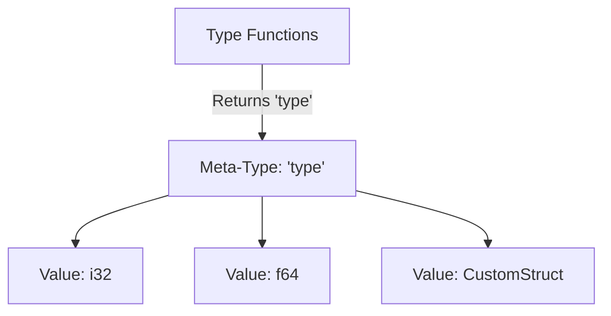
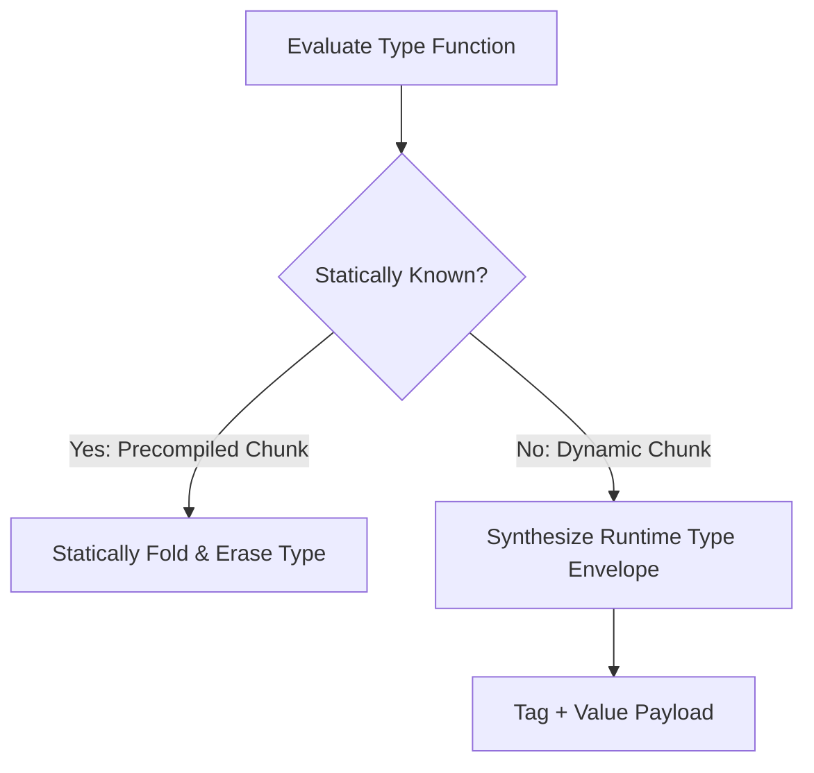

# LayerScript Language: First-Class Types & Generics

This document describes LayerScript's approach to generics, dependent typing, and treating types as first-class values.

---

## 1. Types as First-Class Values

In many languages (like C++, C#, and Java), types exist in a separate universe from values. Generics require special syntax (like `<T>`) and compiler machinery (monomorphization or runtime type erasure).

LayerScript rejects this separation. **In LayerScript, types are first-class values.** A type is simply a value of the built-in meta-type `type`. 



Because types are values, you can pass them to functions and return them from functions, just like integers or strings.

---

## 2. Type Functions (Eliminating Generic Syntax)

Since types are first-class values, LayerScript does not need traditional generic syntax (`<A, B>`). Generics are simply functions that accept parameters of type `type` and return a new `type`.

### A. The Parsing Problem of Generics
In languages like C++ or Rust, parsing `<T>` is syntactically ambiguous. For example, is `foo < a , b > (c)` a generic function call with two type parameters, or is it a comparison `(foo < a) , (b > c)`? 
To resolve this, the parser must perform semantic analysis during parsing to know if `foo`, `a`, and `b` are types or values.

### B. The LayerScript Solution: Standard Function Application
By treating types as regular parameters, LayerScript parses "generics" like normal function calls:

```layerscript
// A type function that takes two types and returns one based on a compile-time check
function typeFunc(A: type, B: type, condition: b1) -> type {
    match condition {
        true => return A,
        false => return B,
    }
}

// Using the type function to define a variable's type
function process_data(use_fallback: b1) {
    // The type of 'result' is determined by the return value of typeFunc
    var result: typeFunc(i32, f64, use_fallback) = 0 as typeFunc(i32, f64, use_fallback);
}
```

## 3. Hybrid Dependent Typing (Precompiled vs. Dynamic Chunks)

To resolve type functions that depend on dynamic inputs, LayerScript splits type evaluation into two distinct phases or "chunks":



### A. The Precompiled Chunk (Static Monomorphization)
If the type function parameters are known at compile time, the compiler completely folds the function and replaces it with the concrete type. There is zero runtime performance cost.

### B. The Dynamic Chunk (Runtime Type Envelopes)
If a type parameter is dynamic (e.g., loaded from a file or network packet), the type boundary "goes past runtime." In this scenario, `layerscriptc` compiles the variable as a **Runtime Type Envelope**.

A Runtime Type Envelope is a structural layout containing:
1. **Type Tag**: A descriptor pointer referencing the concrete layout metadata (size, alignment, trait vtable).
2. **Payload**: The raw bytes of the actual data value.

This hybrid approach allows the language to support flexible, dynamic dependent types without sacrificing the speed of statically-erased compile-time code paths.

---

## 4. Type Aliasing and `int`

To ease the transition for programmers coming from C or C++, LayerScript provides a default type alias `int`.
- By default, `int` is defined as a platform-native signed integer (e.g., `i32` or `i64`).
- Since type aliasing is simple variable assignment in LayerScript, it behaves as:
  ```layerscript
  var int = i32; // On 32-bit platforms
  ```

---

## 5. Generalized Algebraic Data Types (GADTs)

Enums in LayerScript are GADTs. This means that each variant of an enum can carry its own distinct logic refinements, specializing the type constraints based on which variant is instantiated.

```layerscript
// A GADT expressing the status of an external channel read
pub enum ChannelStatus<T> {
    // Ok carries the successfully read value
    Ok(T value),
    
    // Timeout carries the tick elapsed, which must be greater than zero
    Timeout(u64 ticks: where ticks > 0),
    
    // Error carries an error code, which cannot be 0 (success) or 0xFF (reserved)
    Error(u8 code: where code != 0 && code != 0xFF),
}
```

### Path Condition Specialization
When you perform pattern matching on a GADT, the compiler extracts the constraints of the matched variant and asserts them into the local block's logic graph:

```layerscript
function handle_status(status: ChannelStatus<u32>) -> u32 {
    match status {
        Ok(v) => {
            // Path condition: status is Ok(v)
            return v;
        }
        Timeout(t) => {
            // Path condition: status is Timeout(t) AND t > 0
            // The compiler knows t is guaranteed positive
            return 0 as u32;
        }
        Error(c) => {
            // Path condition: status is Error(c) AND c != 0 AND c != 0xFF
            return c as u32;
        }
    }
}
```

---

## 6. Runtime Type Envelope Layout

When types are dynamically resolved at runtime (e.g. dependent on network inputs), the compiler cannot statically erase type metadata. In these cases, variables are boxed into a **Runtime Type Envelope**.

The physical layout of a Runtime Type Envelope on a 64-bit target is structured as:

| Byte Offset | Field | Type | Description |
| :--- | :--- | :--- | :--- |
| `0x00 - 0x07` | **Type Tag** | `usize` | Pointer to the static type descriptor table |
| `0x08 - 0x0F` | **Payload Size** | `usize` | Size of the dynamic value in bytes |
| `0x10 - 0x17` | **VTable Pointer** | `usize` | Pointer to the trait resolution table (methods) |
| `0x18+` | **Value Payload** | `[b8]` | Raw heap-allocated or aligned inline bytes of the value |

### Dynamic Resolution Example
```layerscript
function process_dynamic(T: type, value: T) {
    // 'value' is passed as a Runtime Type Envelope.
    // The VTable is looked up dynamically to locate operations.
    output_trace('DYN_TYPE_SIZE', T::size() as b8);
}
```
