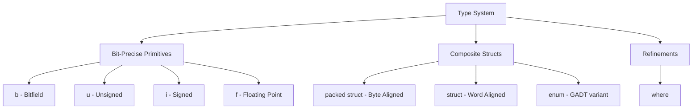

# LayerScript Language: Reference Specification

This document details the formal grammar, keywords, primitive types, literal suffixes, operators, and syntax rules of the **LayerScript programming language**.

---

## 1. Type System and Grammar

LayerScript features a bit-precise, nominal, and refinement-capable type system. There are no fixed-size primitives like `int` or `float` in the compiler; instead, types are parameterized by bit width.



### A. Primitive Data Types
* **Bit Vector (`b<N>`)**: Raw, untyped bits of length `N`. Supports bitwise operators (`&`, `|`, `^`, `~`, `<<`, `>>`). Does not support arithmetic.
  - Examples: `b1`, `b16`, `b1024`.
* **Unsigned Integer (`u<N>`)**: Unsigned scalar integer of length `N`. Supports modular arithmetic.
  - Examples: `u8`, `u32`, `u64`, `u128`.
* **Signed Integer (`i<N>`)**: Signed scalar integer of length `N` in two's complement. Supports checked arithmetic.
  - Examples: `i8`, `i16`, `i32`, `i64`.
* **Floating-Point (`f<N>`)**: Standard IEEE-754 floating-point type of length `N`.
  - Examples: `f32`, `f64`, `f80`.

### B. Compound Types
* **Arrays**: Fixed-size sequences declared as `[T; N]`.
  - Example: `[u8; 1024] buffer;`
* **Pointers**: Raw addresses written as `T*`. Pointer arithmetic is permitted only within bounds established by the constraint system.
  - Example: `i32* ptr;`
* **Structs**:
  - **`struct`**: Standard structures. The compiler is free to reorder fields, add padding, or dissolve fields into registers.
  - **`packed struct`**: Physically aligned fields in the exact order declared, with zero padding. Used for hardware memory mapping and network protocol parsing.
* **Enums**: Sum types supporting GADT (Generalized Algebraic Data Type) syntax, allowing variants to carry constraints.
  - Example:
    ```layerscript
    enum Result<T> {
        Ok(T value),
        Err(i32 code: where code != 0),
    }
    ```

> [!NOTE]
> For a detailed guide on binary representations, range bounds, pointer arithmetic, and contiguous layout logic, see the complete [Base and Compound Types](Base%20and%20Compound%20Types.md) specification.

---

## 2. Keywords and Reserved Tokens

| Keyword | Description |
| :--- | :--- |
| `where` | Appends a logical refinement proposition to a type or parameter. |
| `unreachable` | Weaponized Undefined Behavior; tells compiler a state will never be reached. |
| `panic` | Directs the compiler to insert a runtime assertion/crash if safety check fails. |
| `havoc` | Invalidates compiler caching assumptions about a variable, memory space, or register. |
| `interrupt` | Safely executes inline machine instructions/assembly across hardware boundary. |
| `packed` | Restricts alignment optimizations on structs to preserve layout. |
| `@silent` | Compiler directive converting compile-time proof errors to runtime checks. |
| `@strict` | Compiler directive forcing compile-time verification failure on undecidable bounds. |
| `as` | Casting operator for explicit type conversions. |
| `fn` | Prefixes a function or type-function declaration. |
| `struct` | Declares a composite structure. |
| `enum` | Declares a generalized algebraic data type. |
| `match` | Triggers structural pattern matching. |
| `let` | Binds a variable or type alias in local scope. |
| `return` | Returns a value from a function block. |
| `at` | Layout modifier mapping variables or structs to fixed memory addresses. |

---

## 3. Lexical Structure and Literals

Identifiers must start with an ASCII letter or underscore (`[a-zA-Z_]`), followed by letters, digits, or underscores (`[a-zA-Z0-9_]`). Double underscores (`__`) are reserved for internal compiler intrinsics.

### Literal Value Formatting

* **Integers**:
  - Decimal: `123`, `1_000_000` (underscores allowed for readability)
  - Hexadecimal: `0x7C00`, `0xFF_AA_11`
  - Octal: `0o755`
  - Binary: `0b0000_1100_1010`
* **Bit Vectors**: Declared with a `b` suffix: `0b1010_b4`, `0x1234_b16`
* **Fractions**: Specific to scalar constraints, written as decimals with a `_frac` or `_q` suffix: `0.5_frac`, `0.125_q`
* **Size Suffixes**: Explicit type annotation can be appended to any literal:
  - `42u8`, `1000i64`, `3.14159f64`

---

## 4. Operators and Precedence

Below is the precedence hierarchy of LayerScript operators (from highest to lowest).

| Precedence | Operators | Description | Associativity |
| :--- | :--- | :--- | :--- |
| 1 | `.` `()` `[]` | Member Access, Call, Indexing | Left-to-Right |
| 2 | `!` `~` `-` `*` `&` | Logical Not, Bitwise Not, Negation, Dereference, Address-of | Right-to-Left |
| 3 | `as` | Explicit Casting and Coercion | Left-to-Right |
| 4 | `*` `/` `%` | Multiplication, Division, Remainder | Left-to-Right |
| 5 | `+` `-` | Addition, Subtraction | Left-to-Right |
| 6 | `<<` `>>` | Bitwise Shifts | Left-to-Right |
| 7 | `<` `<=` `>` `>=` | Relational Comparisons | Left-to-Right |
| 8 | `==` `!=` | Equality Comparisons | Left-to-Right |
| 9 | `&` | Bitwise AND | Left-to-Right |
| 10 | `^` | Bitwise XOR | Left-to-Right |
| 11 | `\|` | Bitwise OR | Left-to-Right |
| 12 | `&&` | Logical AND | Left-to-Right |
| 13 | `\|\|` | Logical OR | Left-to-Right |
| 14 | `=` `+=` `-=` `*=` `/=` `%=` | Assignments | Right-to-Left |

> [!NOTE]
> Shift and arithmetic operators are invalid on bit vectors (`b<N>`). Bit vectors only support logical bitwise operators (`&`, `|`, `^`, `~`, `<<`, `>>`). Arithmetic is restricted to `u<N>`, `i<N>`, and `f<N>`.

---

## 5. Reference Syntax Examples

### A. Refined Function Parameters
Constraints are declared inline using the `where` keyword.

```layerscript
// Accepts N and an index, proving at compile time that index is within array bounds.
function get_element<T, N: usize>(T* array, usize index: where index < N) -> T {
    // Because index < N is verified, this array lookup compiles without bounds checking.
    return array[index]; 
}
```

### B. Inline Assembly Interrupts and Havoc
Interfacing with hardware register state:

```layerscript
struct GPUState {
    b32 status_register;
    b32 frame_pointer;
}

function clear_gpu_status(GPUState* gpu) {
    // Write value zero to control register
    gpu.status_register = 0 as b32;

    // Inline interrupt call
    interrupt 'out dx, al', gpu {
        // The interrupt changes the GPU status register.
        // We notify the compiler to discard cached values for status_register.
        havoc gpu.status_register;

        // frame_pointer is not havoc'd, so its cache remains valid.
    }
}
```

### C. Pattern Matching with Semantic Verification
Pattern matching in LayerScript checks value states and updates the path constraint solver.

```layerscript
function parse_index(i32 input) -> i32 {
    match (input >= 0) {
        true => {
            // Inside this block, the SMT solver asserts: input >= 0.
            // We can safely coerce to unsigned without checks.
            var positive_val = input as u32;
            return positive_val as i32;
        }
        false => {
            // SMT solver asserts: input < 0
            panic; // Runtime panic if reached
        }
    }
}
```

### D. Operator Overloading Definition
Operators are overloaded by implementing standard traits (e.g. `Add<T>`).

```layerscript
trait Add<T> {
    type Output;
    function add(&self, &T rhs) -> Output;
}

impl Add<i32> for i32 {
    type Output = i32;
    
    // Explicit addition carrying the proof obligation 'h'
    function add(&self, &i32 rhs) -> i32 {
        // Under strict mode, compilation fails if the compiler cannot prove
        // that overflow does not occur.
        return intrinsic_add(self, rhs);
    }
}
```

### E. Namespace and Module Declarations
LayerScript code is organized into logical namespaces and files (modules).

```layerscript
// Declare the namespace for this module
namespace graphics::drivers::vga;

// Imports are brought into scope using 'import'
import core::hardware::{VolatileAddress, register_flush};
import core::executor as exec; // Importing with an alias

// Visibility is private by default. Use 'pub' to make symbols accessible externally.
pub struct VGAAdapter {
    usize frame_buffer_address;
}

pub function initialize_adapter(VGAAdapter* adapter) {
    // Adapter initialization logic
}

function internal_helper() {
    // Only accessible within this namespace module
}
```

### F. Custom Implicit Coercion Syntax
Implicit coercions specify how the compiler can automatically convert one type to another. They are defined using the `operator coerce` syntax.

```layerscript
struct Meters {
    u64 value;
}

struct Feet {
    u64 value;
}

// Define an implicit coercion from Meters to Feet
pub function operator coerce(Meters m) -> Feet {
    // Since feet and meters represent the same physical domain (length),
    // this conversion is conceptually safe to perform implicitly.
    var conversion_factor = 328 as u64; // scale by 100 for fixed-point
    return Feet { value: (m.value * conversion_factor) / 100 };
}

// Defining a coercion with a type mapping signature:
// Declares that Type A implicitly coerces to Type B
fraction -> float;
```
