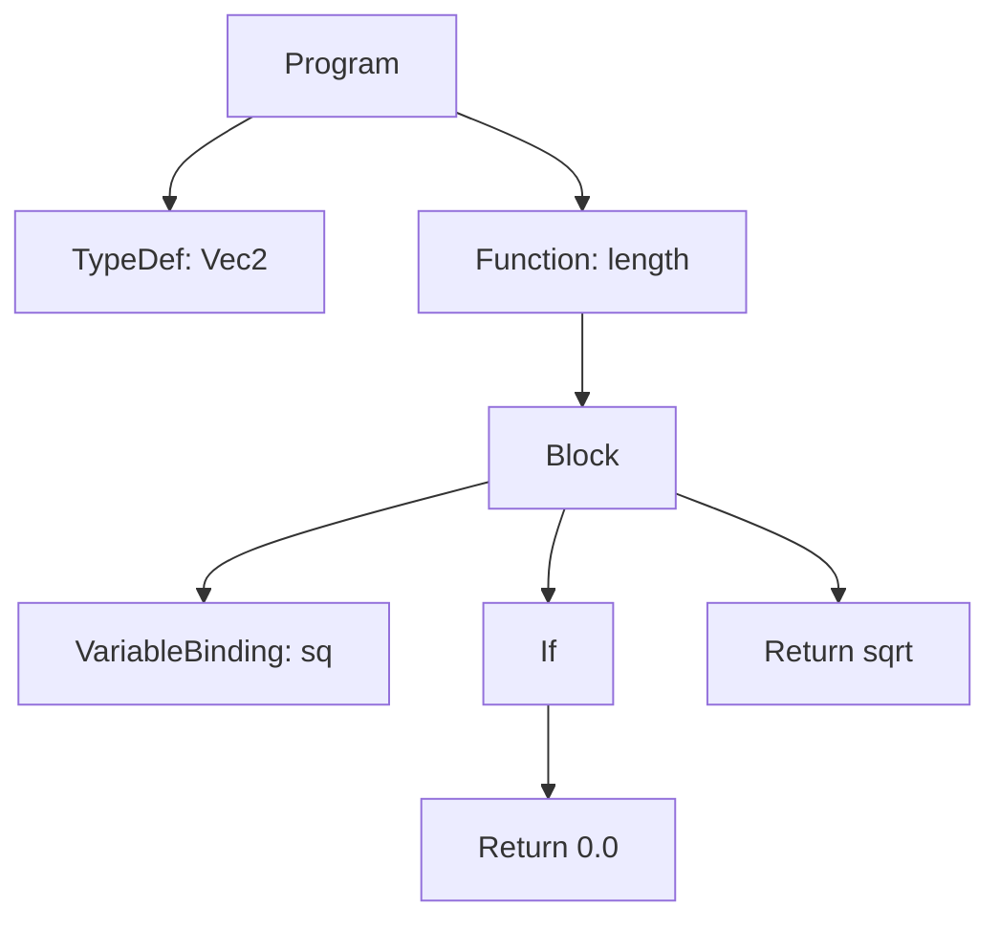

# Layer System Examples

Worked examples of the [Layer System](../Language%20Specification/Layer%20System.md) in practice: how nesting builds the tree, how type inheritance and shadowing behave across scopes, how to introspect with [layertrace](../Execution%20Model/layertrace%20Runtime.md), and how to compose multiple hooks.

---

## 1. Reading the Layer Tree

Every construct nests into a parent, forming the tree the compiler optimizes over. This snippet's structure is annotated with its layers:

```layerscript
// Program layer (root)
struct Vec2 { x: f64, y: f64 }          // + child: type definition

function length(v: Vec2) -> f64 {        // Function layer
    var sq = v.x * v.x + v.y * v.y;      //   Block > VariableBinding layer
    if (sq == 0.0) {                     //   Block > If layer
        return 0.0;                      //     Return layer
    }
    return sq.sqrt();                    //   Return layer
}
```



---

## 2. Type Inheritance and Shadowing

Types resolve outward through the layer hierarchy; an inner definition shadows an outer one only within its subtree (see [Type Storage and Inheritance](../Type%20System%20and%20Coercions/Type%20Storage%20and%20Inheritance.md)).

```layerscript
type Id = u64;                 // defined on the Program layer

function outer() {
    var a: Id = 1;             // a : u64

    function inner() {
        type Id = u32;         // shadows Id inside `inner` only
        var b: Id = 2;         // b : u32
    }

    var c: Id = 3;             // c : u64  (outer Id still in effect)
}
```

---

## 3. `layertrace` Usage

Introspect the running program to drive logging, assertions, or metadata-aware behavior.

```layerscript
function compute(n: u32) -> u32 {
    layertrace.push("compute");                 // open a named scope
    var here = layertrace.current();
    trace!("entering {} (kind={})", "compute", here.kind);

    var doc = layertrace.get_metadata("doc");   // read this layer's docs
    var result = n * n;

    layertrace.pop();                            // close the scope
    return result;
}

function dump_types() {
    var all = layertrace.root().get_all_visible_types();
    for (var ty in all) {
        trace!("visible type: {}", ty.name);
    }
}
```

---

## 4. Hook Composition

Multiple hooks compose into a validation pipeline. Here a temperature is both clamped and logged, and a derived `is_critical` flag is kept in sync — all without any call site knowing.

```layerscript
var temperature: f64 = 20.0 {
    // 1. clamp into the physically valid range (runs first, transforms the value)
    on_change: function(new: f64, old: f64) -> f64 {
        if (new < -273.15) { return -273.15; }
        if (new > 1000.0)  { return 1000.0; }
        return new;
    }
    // 2. react to the committed value (runs after the store)
    on_assign: function(value: f64) {
        if (value > 90.0) { trace!("WARNING: {} C", value); }
    }
}

function heat() {
    temperature = 5000.0;   // clamped to 1000.0, then warning is logged
}
```

Recall the ordering: `on_change` runs **before** the store and its return is stored; `on_assign` runs **after**. For the full firing model see the [Hooks Runtime](../Execution%20Model/Variable%20Behavior%20Hooks%20Runtime.md).

## See also
- [Layer System](../Language%20Specification/Layer%20System.md)
- [Variables and Hooks](../Language%20Specification/Variables%20and%20Hooks.md)
- [layertrace Runtime](../Execution%20Model/layertrace%20Runtime.md)
