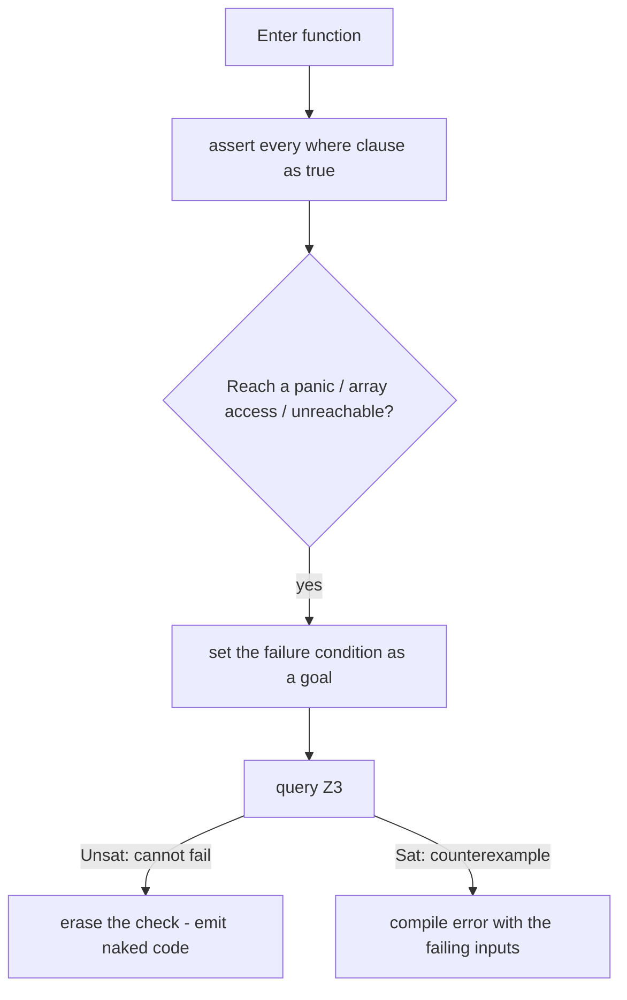

# Refined Types

A **refined type** is a base type plus a logical predicate that every value of the type must satisfy: `T where <predicate>`. Refinements are LayerScript's core mechanism for *zero-cost safety* — the compiler proves the predicate at compile time and then erases it, so the machine code carries no runtime check.

---

## 1. `where` Clauses

Attach a predicate to a type, a parameter, or a field with `where`. The bound value is referred to by its name (or `self` for the whole type).

```layerscript
// Parameter refinement: index is proven in range by the caller.
function process(index: u32 where index < 10) { /* ... */ }

// Named alias: reuse a common proof.
type Percent = u8 where self <= 100;

// Field refinement on a struct.
struct Connection {
    fd: i32 where fd >= 0,
    port: u16 where port != 0,
}
```

Predicates may reference other in-scope values, including const generics:

```layerscript
function get<T, N: usize>(arr: [T; N], i: usize where i < N) -> T {
    return arr[i];      // no bounds check survives
}
```

The standard library predefines the common ones — `NonZero<T>`, `Positive<T>`, `Index<N>`, `Aligned<T, A>` — documented in the [Built-in Types Reference](../API%20and%20Standard%20Library/Built-in%20Types%20Reference.md).

### Explicit Fallbacks (`else` Clauses)

When external inputs or dynamic parameters may legitimately exceed ideal bounds, LayerScript supports declarative fallback expressions directly in the type refinement:

```layerscript
// If sensor_val exceeds 100 at runtime, it evaluates and falls back to 100.
function clamp_read(sensor_val: u32 where sensor_val <= 100 else 100) -> u32 {
    return sensor_val;
}
```

- **Without `else`**: A failed constraint in `@strict` mode is a compile-time rejection; in safe runtime execution, it aborts loudly with a `TypeError` (no silent corruption or hidden failure).
- **With `else`**: If the predicate evaluates to `false`, the fallback expression is evaluated and bound to the parameter instead.

### Why Refinement Types Replace Untyped `null`

In traditional languages (C#, Java, JavaScript), `null` is an ambient inhabitant of every reference type, causing hidden runtime null-pointer exceptions (the "billion-dollar mistake"). 

LayerScript eliminates ambient untyped `null`. Instead:
1. **Compile-Time Validity**: Types are guaranteed non-null and valid by default via SMT proofs.
2. **Explicit Fallibility**: Unhandled or optional outcomes are expressed via explicit result states / enums or refinement fallbacks, allowing long-running programs to fail gracefully without hidden crashes.

---

## 2. SMT-LIB v2 Translation

The [elaborator (Ring 2)](../Compiler%20Mechanics/Elaboration%20and%20Constraints.md) lowers each predicate into SMT-LIB v2 and asks a solver (Z3) whether the program can ever violate it.

### Translation rules

LayerScript expressions map directly to SMT prefix notation:

| LayerScript | SMT-LIB v2 |
| :--- | :--- |
| `x + y` | `(+ x y)` |
| `x * y` | `(* x y)` |
| `x <= 100` | `(<= x 100)` |
| `x < N && y >= 0` | `(and (< x N) (>= y 0))` |
| `i32` value `x` | `(declare-const x (_ BitVec 32))` |

Bit-precise types become fixed-width `BitVec` sorts, so overflow and wrap-around are modeled faithfully rather than as unbounded integers.

### The proof flow



1. **Assertion** — on entry, all `where` clauses are asserted true (the caller guaranteed them).
2. **Safety goal** — at each `panic`, bounds access, or `unreachable`, the failing condition becomes a goal to prove impossible.
3. **Verification** — `Unsat` means the failure is unreachable, so the guard is deleted. `Sat` yields a concrete counterexample and a compile error.

---

## 3. Modes: `@strict` vs `@silent`

What happens when the solver *cannot* decide a predicate is controlled by directives:

- **`@strict`** (default for safety-critical builds) — an undecidable or unprovable refinement is a **compile error**.
- **`@silent`** — the compiler falls back to inserting a **runtime check** (`panic` on violation) instead of failing the build. Useful during development or across boundaries the solver can't see.

```layerscript
@silent
function from_untrusted(n: u32) -> Index<256> {
    return n;   // if unprovable, a runtime bound check is inserted here
}
```

## See also
- [Coercion Guide](Coercion%20Guide.md)
- [Elaboration and Constraints](../Compiler%20Mechanics/Elaboration%20and%20Constraints.md)
- [Observability and Trace Folding](../Compiler%20Mechanics/Observability%20and%20Trace%20Folding.md)
