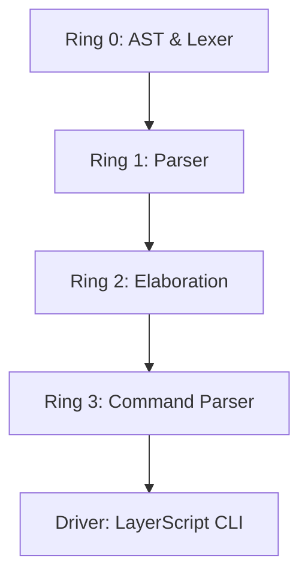

# LayerScript: The Principle of Most Speed

layerscript is a bare-metal systems language built for one thing: speed. we don't just compile code; we model it as a graph of traces and use math to delete every check the computer doesn't absolutely need.

## 🏗️ ring architecture

the compiler is split into unidirectional rings. lower rings are the foundation, higher rings do the heavy lifting.

| ring | module | status | description |
| :--- | :--- | :--- | :--- |
| **ring 0** | `ast`, `lexer` | ✅ complete | foundation, tokens, and the "everything is a layer" model. |
| **ring 1** | `parser` | ✅ complete | turns raw tokens into recursive layer trees. |
| **ring 2** | `elaboration` | 🚧 in progress | smt-lib translation and pomset dependency logic. |
| **ring 3** | `command_parser`| ✅ complete | handling the cli so you can actually run it. |



---

## 🚀 how it works

### everything is a layer
in layerscript, we don't have "statements" or "expressions" in a flat list. everything—from the whole program down to a single variable hook—is a **layer**. 
- layers can have children (nested code).
- layers track their own metadata (docs, line numbers).
- layers hold **logical constraints** that tell the compiler how they can be optimized.

### smart mutability
- **`var`**: always mutable. you can change it whenever.
- **`let`**: You can do mut to make it mutable.

### zero-cost safety (smt & refinements)
we use refinement types to prove code is safe *before* it runs. if you have a variable `x: u32 where x < 10`, the elaborator translates that into **smt-lib v2** logic.
- the compiler asks an smt solver (like z3): "is it mathematically possible for this code to crash?"
- if the answer is "no," the compiler **erases the proof** and generates raw, naked machine code with zero runtime checks.

### variable hooks
you can attach reactive logic to variables.
- `on_change`: runs when the value is updated (perfect for clamping).
- `on_read`: runs when the value is accessed (perfect for lazy loading or tracing).

---

## 💎 code style: pascalcase

the compiler source (rust) uses **pascalcase** for everything:
- `fn RunPipeline`
- `let SourceCode`
- `struct ElaborationContext`

this keeps our logic separate from standard rust libraries and makes the ring boundaries clear.

## 🛠️ build and run

```powershell
# check if the workspace is healthy
cargo check

# run a compile on the examples
cargo run -- compile examples/refinement.layerscript
cargo run -- compile examples/variable_hooks.layerscript
```

check the LayerScript obsidian vault for the full specs. 🚀
