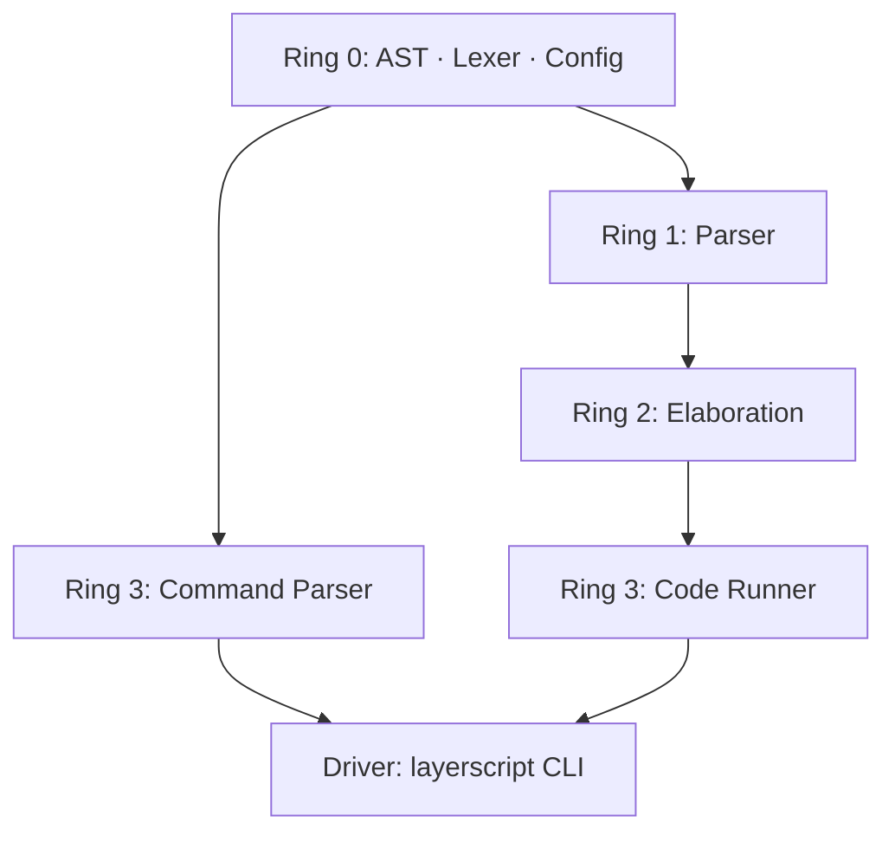
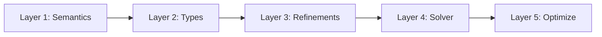

# LayerScript: The Principle of Most Speed

LayerScript is a bare-metal systems language built for one thing: **speed**. We don't just compile code — we model it as a graph of traces and use math to delete every check the computer doesn't absolutely need.

The design comes from three ideas working together:

1. **Everything is a Layer.** The whole program, every function, every variable, every hook — one universal AST node with children, metadata, constraints, and scope tables (`TypeStorage` and `VariableStorage`).
2. **Refinement types with proofs.** `where` clauses lower to SMT-LIB and get discharged by a solver at compile time; proven-safe checks are **erased** from the machine code.
3. **POMSET semantics.** Programs are a *Partially Ordered Multiset* of traces; anything outside the observability boundary can be folded, reordered, or run in parallel.

Full language reference: the [LayerScript Obsidian vault](./LayerScript%20Obsidian) — see [`Home.md`](./LayerScript%20Obsidian/Home.md).

---

## 🏗️ Ring Architecture

The compiler is a Cargo workspace of **unidirectional rings**. Lower rings never depend on higher ones — this is the invariant that keeps the compiler compositional and avoids initialization loops.

| Ring | Crate(s) | Status | Role |
| :--- | :--- | :--- | :--- |
| **Ring 0** | [`ast`](./rings/ring0/ast), [`lexer`](./rings/ring0/lexer), [`config`](./rings/ring0/config) | ✅ complete | Foundation: `Layer`, `Type`, `Expression`, `TypeStorage`, `VariableStorage` |
| **Ring 1** | [`parser`](./rings/ring1/parser) | ✅ complete | Turns tokens into recursive layer trees & registers scoped variables |
| **Ring 2** | [`elaboration`](./rings/ring2/elaboration) | 🚧 ~55% | Five-layer pipeline: semantics → types → refinements → **from-scratch solver** → optimization ([Elaboration Pipeline](./LayerScript%20Obsidian/Compiler%20Mechanics/Elaboration%20Pipeline.md)) |
| **Ring 3** | [`command_parser`](./rings/ring3/command_parser), [`code_runner`](./rings/ring3/code_runner) | ✅ complete | CLI + tree-walking interpreter (with dynamic type & refinement checks) |
| Driver | [`layerscript`](./layerscript) | ✅ wires the pipeline | `RunPipeline`: lex → parse → elaborate → run |



**Elaboration is itself a five-layer pipeline** — see [Elaboration Pipeline](./LayerScript%20Obsidian/Compiler%20Mechanics/Elaboration%20Pipeline.md):



Layer 4 is a **from-scratch** solver — interval propagation over linear integer arithmetic plus bounded enumeration. No Z3 dependency.

For a file-by-file walkthrough, see [Codebase Reference](./LayerScript%20Obsidian/Compiler%20Mechanics/Codebase%20Reference.md) in the vault.

---

## 🚀 How It Works

### Everything is a Layer
In LayerScript there is no flat list of "statements" and "expressions". Every construct — the whole program, a function, a block, a variable binding, a hook — is a **layer**:
- Layers have **children** (nested code).
- Layers carry **metadata** (source location, docs, directives, optimization hints).
- Layers hold **logical constraints** that tell the compiler how they can be optimized.
- Layers carry **TypeStorage** and **VariableStorage** tables keeping track of types and variable bindings defined within their lexical scope. During parsing, variables declared in a binding are registered directly onto the enclosing layer's `VariableStorage`.
- Layers have an **observability boundary** — if nothing outside the program can see a value, the compiler is free to delete it.

### Smart mutability
- **`var`** — mutable. You can reassign whenever.
- **`let`** — immutable by default. `let mut` makes it mutable.

```layerscript
var counter = 0;    // reassignable
let pi = 3.14159;   // fixed
```

### Zero-cost safety (SMT & refinements)
Refinement types let you attach a logical predicate to a type. Given `x: u32 where x < 10`, the elaborator lowers the predicate into **SMT-LIB v2** and asks a solver (Z3) whether the code can ever violate it:

- If the answer is **`unsat`** ("never"), the compiler **erases the check** and emits naked machine code.
- If it's **`sat`**, compilation fails with a concrete counterexample.
- Under `@silent`, an undecidable case falls back to a runtime check; under `@strict`, it's a hard error.
- **Explicit Fallbacks**: Refinements support explicit fallbacks via `val: u32 where val <= 100 else 100`, providing deterministic recovery without ambient, untyped `null` pointer vulnerabilities.

Result: safe array indexing, non-null pointers, alignment guarantees — all with **zero runtime overhead**.

### Runtime Interpreter Enforcement
During execution in the tree-walking interpreter (`code_runner`):
- Whenever a function is invoked, the interpreter performs a runtime check on each argument to verify it matches the parameter's base type (including bit-precise integer sizes like `u32`/`i32`).
- The interpreter evaluates `where` refinement constraints dynamically inside the function's call frame. If a constraint evaluates to `false` and no `else` fallback is declared, execution immediately fails loudly with a runtime `TypeError`.
- The interpreter fully implements comparison operators (`<`, `<=`, `>`, `>=`, `==`, `!=`), logical operators (`&&`, `||`), and disjunctions (`or`).
- Mutable variable assignment (`LayerKind::Assignment`) is fully supported across local and global scopes.
- The interpreter supports nested block scopes (`{ ... }` / `LayerKind::Block`) and handles nested `return` propagation cleanly across blocks and conditionals via a global return state tracking system.
- The interpreter supports built-in functions such as `type(arg)`, which returns the string representation of any value's runtime type (e.g., `"int"`, `"float"`, `"bool"`, `"string"`, `"unit"`).

### Variable hooks
Reactive logic attached to a binding:
- `on_change` runs **before** the store; its return is what gets stored (validation, FFI sanitization).
- `on_read` runs when the value is accessed (lazy loading, tracing).
- `on_assign` runs **after** the store commits (notifications, telemetry).

Anything a hook does that the observability analysis proves has no effect gets folded away, so you can write hooks freely for correctness.

### POMSET & the observability boundary
Once elaboration has run, the compiler has (a) a graph of traces with partial ordering and (b) a set of values that actually escape the program. Anything not needed to produce the observable output can be reordered, parallelized, or deleted outright. This is where the "principle of most speed" cashes out.

---

## 💎 Code style: PascalCase

The compiler source (Rust) uses **PascalCase** for LayerScript-owned items:

```rust
fn RunPipeline(SourceCode: &str, Verbose: bool) { … }
struct ElaborationContext { … }
let Tokens: Vec<Token> = LexerStruct::New(SourceCode).collect();
```

Each crate opts out with `#![allow(non_snake_case)]` / `#![allow(non_camel_case_types)]`. This visually separates compiler logic from `std`/library calls and makes the ring boundaries obvious at a glance.

---

## 🛠️ Build and Run

```powershell
# check the whole workspace
cargo check

# run the compiler on example programs
cargo run -- compile examples/refinement.ls
cargo run -- compile examples/error_handling_and_state.ls
cargo run -- compile examples/variable_hooks.ls -O3

# compile with verbose parser debug logs
cargo run -- --debug compile examples/stress_test.ls

# evaluate a snippet without a file
cargo run -- eval "function main() { var x = 30; let y = 3.5; var z: i32 = 7; }"

# get help
cargo run -- --help
```

The end-to-end pipeline (lex → parse → elaborate → run) is verified for simple programs and prints `Verification & Compilation Successful!` followed by the program execution output. Any runtime refinement violations without fallbacks are caught and printed as type errors:

```text
SCORE 85
Execution Error: TypeError("Parameter 'score' failed refinement check in call to 'process_score'"),
 Line: 15
```

Full CLI documentation: [CLI Reference](./LayerScript%20Obsidian/API%20and%20Standard%20Library/CLI%20Reference.md).

---

## 📁 Repository Layout

```
LayerScript/
├── Cargo.toml                  # workspace manifest
├── layerscript/                # driver crate — RunPipeline lives here
│   └── src/main.rs
├── rings/
│   ├── ring0/
│   │   ├── ast/                # Layer, Type, Expression, VariableStorage, builders
│   │   ├── lexer/              # Text → Vec<Token>
│   │   └── config/             # global compiler settings
│   ├── ring1/parser/           # Tokens → Layer tree
│   ├── ring2/elaboration/      # constraints, SMT translation
│   └── ring3/
│       ├── command_parser/     # clap CLI: compile / eval / test
│       └── code_runner/        # tree-walking interpreter
├── examples/                   # *.ls sample programs
└── LayerScript Obsidian/       # documentation vault (Obsidian)
    ├── Home.md
    ├── Complete Gameplan.md    # top-level roadmap
    └── Gameplan/               # one detailed plan per phase
```

---

## 🗺️ Where To Go Next

- **Contributing / roadmap:** [Complete Gameplan](./LayerScript%20Obsidian/Complete%20Gameplan.md) and the phase-by-phase [`Gameplan/`](./LayerScript%20Obsidian/Gameplan) folder.
- **Language reference:** [Home](./LayerScript%20Obsidian/Home.md), especially [Syntax and Grammar](./LayerScript%20Obsidian/Language%20Specification/Syntax%20and%20Grammar.md) and [Layer System](./LayerScript%20Obsidian/Language%20Specification/Layer%20System.md).
- **Codebase orientation:** [Codebase Reference](./LayerScript%20Obsidian/Compiler%20Mechanics/Codebase%20Reference.md) — every file, what it owns, and what still needs doing.
- **Glossary:** [Glossary](./LayerScript%20Obsidian/Glossary.md) for quick term lookups.
