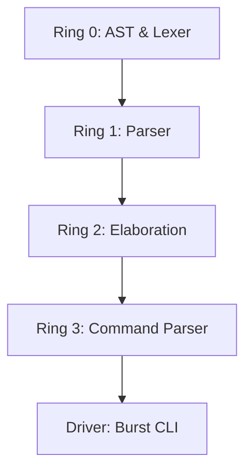

# Burst: The Principle of Most Speed

Burst is an experimental, bare-metal systems programming language designed for hyper-aggressive optimization and zero-overhead safety.

## 🏗️ Ring Architecture

The compiler is structured into unidirectional layers (Rings) to maintain strict separation of concerns:

| Ring | Module | Status | Description |
| :--- | :--- | :--- | :--- |
| **Ring 0** | `ast`, `lexer` | ✅ Complete | Foundation, Syntax Trees, and Tokenization. |
| **Ring 1** | `parser` | ✅ Complete | Transforming Token streams into Recursive `Layer` trees. |
| **Ring 2** | `elaboration` | 🚧 In Progress | SMT Constraint Extraction and POMSET analysis. |
| **Ring 3** | `command_parser`| ✅ Complete | CLI arguments and workspace management. |



## 🚀 Key Features

- **Everything is a Layer**: Unified structure for functions, blocks, and variables.
- **Variable Hooks**: Integrated `on_change` and `on_read` behaviors.
- **Refinement Types**: Zero-overhead safety using SMT-based formal verification.
- **PascalCase Rust**: Standardized coding style across the compiler implementation.

## 🛠️ Build and Run

```powershell
# Check workspace
cargo check

# Run compiler on examples
cargo run -- compile examples/refinement.burst
cargo run -- compile examples/variable_hooks.burst
```
